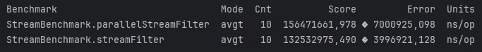

# Jacoco - Reporte de cobertura

# Benchmark

La conclusión a la que puedo llegar en base a los resultados obtenidos de la ejecución de las pruebas benckmark para la
clase StreamBenchmark es que en este caso específico es más rápido cuando se utiliza Stream en comparación con
ParallelStream.
El rendimiento de stream es superior, con un tiempo promedio de 132,532,975.490 nanosegundos, en comparación con
156,471,661.978 nanosegundos para parallelStream.
También es importante recordar que los resultados pueden variar dependiendo de las características exactas de la tarea y
del entorno de ejecución ya que, aunque parallelStream puede ser más rápido, también puede tener un mayor costo de
configuración y coordinación, lo que puede hacerlo menos eficiente para operaciones más pequeñas o más simples.
Entonces puedo concluir que no hay una alternativa que sea mejor en todos los casos sino que siempre es importante
realizar pruebas de rendimiento para determinar la mejor opción para cada caso específico.

# Correcciones - Estado: APROBADO
## Adicionales:
- Ejercicio 2: Deben duplicar el codigo anterior, no modificarlo en el mismo archivo. NO utilizar
  optimizaciones del compilador JIT (Just In Time). Para ésto deberían de utilizar el objeto BlackHole, el cual les
  permite tener resultados sin sesgos en cuanto a la optimización del compilador, pueden ver un ejemplo
  acá https://www.baeldung.com/java-microbenchmark-harness#dead-code-elimination. En las pruebas de Benchmark se repite
  el código para ciertos decorators como @OutputTimeUnit(TimeUnit.NANOSECONDS) y @BenchmarkMode(Mode.AverageTime).
  Podrían ir al nivel de la clase Ejercicio2.
- Se podrían optimizar los imports.
- La estructura de las carpetas podría separarse entre cada ejercicio de una manera más granular. Pordían separar entre
  ClasesATestear, Ejercicio3, Ejercicio4, Ejercicio2/PruebaBenchmark y colocar cada archivo en cada package correspondiente.
- En ésta misma linea, si hacen el refactor sugerido en el punto anterior, los tests siempre deberían de ir en el mismo
  package y tener la misma estructura de carpetas que en main, por lo tanto en vez de ir en test/java deberían de ir
  dentro de test/java/org/example/TestClasesATestear
- En la elaboración de sus conclusiones, es fundamental que incluyan los valores obtenidos en la descripción y
  cuantifiquen los resultados con medidas específicas. Al hacer esto, sus conclusiones serán más precisas y sólidas.
  Para futuros trabajos, les sugiero actualizar directamente el archivo `README.md` con estas conclusiones y las nuevas
  imágenes pertinentes, en lugar de incluirlas únicamente en la sección de "Correcciones realizadas".

  En relación a los resultados, la conclusión presentada es correcta; sin embargo, me gustaría destacar un
  aspecto crucial. Es importante que comprendan que, a pesar de las variaciones posibles debido al hardware utilizado,
  (como podemos observar en su caso particular) la diferencia principal radica en cómo se utilizan los núcleos de la CPU
  en los diferentes enfoques.

  En un enfoque secuencial, se emplea un único núcleo de la CPU, por lo que el tiempo de ejecución se basa únicamente en
  el rendimiento de ese núcleo para completar todas las operaciones. En contraste, el **Stream Paralelo** debería
  resultar considerablemente más rápido que el **Stream Secuencial** en términos de tiempo de ejecución (en éste caso
  medido en milisegundos por operación, ms/op).

  Suponiendo que contamos con 2 núcleos, el rendimiento paralelo idealmente debería acercarse a la mitad del tiempo
  requerido por el método secuencial, siempre y cuando el procesamiento se distribuya de manera óptima y no existan
  otros cuellos de botella. No obstante, en la práctica, esta mejora ideal rara vez se alcanza.

  Además, es posible observar que el margen de error en el **Método Paralelo** puede ser menor si el paralelismo se
  gestiona de manera eficiente y los hilos se distribuyen adecuadamente entre los núcleos. Sin embargo, si la gestión
  del paralelismo es inadecuada, debido a la sincronización y la administración de hilos, el margen de error podría ser
  incluso mayor que en el **Método Secuencial**.

  Otro aspecto importante a considerar, es que en el enfoque paralelo el orden de ejecución no está bajo nuestro control
  y puede darnos resultados impredecibles y desordenados y, como cualquier otra programación paralela, son complejos y
  propensos a errores. Pueden consultar éstos enlaces si desean investigar más: [1], [2].

  Aunque éstas observaciones son complementarias y su trabajo está muy bien, espero que estas observaciones les
  sean útiles para futuros trabajos y la correcta interpretación de los resultados.
- En ésta misma línea, les sugiero que sigan buenas prácticas al realizar commits, tales como utilizar verbos en
  imperativo y emplear prefijos para aportar claridad semántica. Les recomiendo leer éste artículo sobre un
  desarrollador español que aborda estos aspectos y otros puntos relevantes. [3]
- Además, he notado que los archivos no han sido formateados adecuadamente y no se ha respetado el número máximo de
  caracteres por línea (la línea gris vertical que tienen en Intellij marca justamente ésto). Un ejemplo es en el
  archivo `README.md`, donde las líneas largas dificultan la lectura al exceder los límites visibles de la pantalla. En
  IntelliJ, pueden formatear el código utilizando el atajo de teclado Ctrl + Alt + L [4]. Con otros shortcuts pueden
  optimizar los imports, y muchas cosas más, aunque esto puede variar según el caso si han cambiado la configuración por
  default.

### Bibliografía:

- \[1]: https://www.geeksforgeeks.org/parallel-vs-sequential-stream-in-java/
- \[2]: https://medium.com/@jadhavsid1101/java-parallel-streams-when-to-use-them-and-when-not-to-211d92ac9e38
- \[3]: https://midu.dev/buenas-practicas-escribir-commits-git/
- \[4]: https://www.jetbrains.com/guide/java/tutorials/reading-code/formatting/#:~:text=If%20we%20encounter%20code%20that,L%20(Windows%2FLinux).

